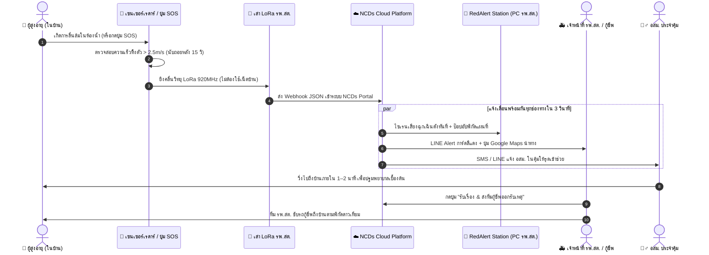

# 📡 พิมพ์เขียวสถาปัตยกรรมระบบโครงข่ายแจ้งเตือนเหตุวิกฤตและตรวจจับการล้มอัจฉริยะระดับตำบล (Tansum Smart LoRaWAN Emergency & Fall Detection Grid)

> **เอกสารการออกแบบระบบฉบับสมบูรณ์ (Comprehensive System Architecture & Engineering Design Blueprint)**  
> **หน่วยงาน**: สาธารณสุขอำเภอตาลสุม ร่วมกับ โรงพยาบาลส่งเสริมสุขภาพตำบล (รพ.สต.) เครือข่ายอำเภอตาลสุม จังหวัดอุบลราชธานี  
> **ระบบหลักที่เชื่อมต่อ**: NCDs Prevention & Smart Health Portal v3.3+ (SSOTansum NCD Platform)  
> **วันที่จัดทำ**: สิงหาคม 2026

---

## 1. บทนำและโจทย์ความท้าทายจริงในพื้นที่ (Problem Statement & Real-World Context)

### 1.1 ความเป็นมาและช่องว่างของเทคโนโลยีเดิม
ในการดูแลผู้สูงอายุและผู้ป่วยกลุ่มเสี่ยงโรคไม่ติดต่อเรื้อรัง (NCDs) ในพื้นที่ชนบท การเกิด **"อุบัติเหตุพลัดตกหกล้ม (Elderly Falls)"** และ **"ภาวะวิกฤตเฉียบพลัน (Acute Cardiovascular/Cerebrovascular Events)"** ถือเป็นสาเหตุหลักของความพิการและเสียชีวิต โดยเฉพาะการล้มในห้องน้ำหรือล้มขณะอยู่บ้านลำพัง

จากการวิเคราะห์สภาพปัญหาในระดับครัวเรือน พบข้อจำกัดที่ทำให้ระบบแจ้งเตือนแบบเดิม (ผ่านสมาร์ตโฟน/แอปพลิเคชัน) ใช้งานไม่ได้จริง:
1. **ข้อจำกัดด้านโครงสร้างพื้นฐาน (Zero Home Broadband)**: บ้านผู้สูงอายุในชนบทส่วนใหญ่ไม่มีอินเทอร์เน็ตบ้าน (No Home WiFi/Fiber)
2. **ข้อจำกัดด้านการใช้งานอุปกรณ์ (High Interaction Friction)**: เมื่อผู้สูงอายุล้ม มักไม่ได้พกโทรศัพท์ติดตัว, โทรศัพท์ล็อกหน้าจอ, ปิดเน็ตมือถือเพราะกลัวเปลือง หรือผู้ป่วยอาจหมดสติ/ขยับตัวไม่ได้ (Incapacitated)
3. **ระยะเวลาทองในการช่วยชีวิต (Golden Period & Response Time)**: หากไม่มีผู้พบเห็นภายใน 30–60 นาที อัตราการเกิดภาวะแทรกซ้อน (เช่น เลือดคั่งในสมอง, กระดูกสะโพกหัก, ภาวะขาดน้ำ/กล้ามเนื้อสลาย) จะเพิ่มขึ้นอย่างก้าวกระโดด

### 1.2 วัตถุประสงค์ของระบบ
1. ออกแบบระบบตรวจจับการล้มและขอความช่วยเหลือฉุกเฉินที่ **"ผู้ป่วยไม่ต้องมีโทรศัพท์มือถือ ไม่ต้องมีเน็ตบ้าน และไม่ต้องพิมพ์ข้อความใดๆ"**
2. ใช้โครงข่ายคลื่นวิทยุระยะไกลพลังงานต่ำ **LoRaWAN (ย่านความถี่ 920–925 MHz)** ติดตั้งเสาแม่ข่ายที่ รพ.สต. เพียงจุดเดียวเพื่อครอบคลุมบ้านผู้สูงอายุทั้งตำบล
3. เชื่อมต่อสัญญาณเตือนเข้าสู่ระบบ **NCDs Portal, โปรแกรมประจำสถานี NCDs RedAlert Station Desktop และ LINE Messaging API** เพื่อระดมความช่วยเหลือจาก **อสม. ประจำคุ้ม (First Responder)** และ **ทีมกู้ชีพ รพ.สต./1669** ได้ภายใน 1–3 นาที

---

## 2. แผนภาพสถาปัตยกรรมระบบ 4 เลเยอร์ (4-Tier System Architecture)

```
┌────────────────────────────────────────────────────────────────────────────────────────────────────────┐
│                                   LAYER 1: PERCEPTION & EDGE SENSING                                   │
│  [ ในบ้านผู้สูงอายุ (ไม่ต้องมีเน็ตบ้าน / แบตเตอรี่ 2-3 ปี) ]                                             │
│                                                                                                        │
│   ┌───────────────────────────┐      ┌───────────────────────────┐      ┌──────────────────────────┐   │
│   │ 🚿 mmWave Fall Radar      │      │ 🚨 LoRa SOS Button        │      │ ⌚ 4G/LoRa Wearable Band │   │
│   │ (เรดาร์ติดเพดานห้องน้ำ)    │      │ (ปุ่มฉุกเฉินไร้สายติดผนัง)│      │ (สายรัดข้อมือตรวจจับล้ม)  │   │
│   └─────────────┬─────────────┘      └─────────────┬─────────────┘      └────────────┬─────────────┘   │
└─────────────────┼──────────────────────────────────┼─────────────────────────────────┼─────────────────┘
                  │                                  │                                 │
                  ▼                                  ▼                                 ▼
                  คลื่นวิทยุ LoRa Radio Frequency (920 - 925 MHz AS923) ระยะส่ง 3 - 8 กิโลเมตร
                  │                                  │                                 │
┌─────────────────┼──────────────────────────────────┼─────────────────────────────────┼─────────────────┐
│                 ▼                                  ▼                                 ▼                 │
│                                  LAYER 2: NETWORK & GATEWAY INFRASTRUCTURE                             │
│  [ เสาแม่ข่าย รพ.สต. / เสากระจายข่าวประจำตำบล ]                                                        │
│                                                                                                        │
│   ┌────────────────────────────────────────────────────────────────────────────────────────────────┐   │
│   │ 📡 Outdoor Industrial LoRaWAN Gateway (IP67) + เสาอากาศ Fiber Glass Omni 8 dBi                 │   │
│   │ (ติดตั้งบนอาคาร รพ.สต. เชื่อมต่อ LAN/Internet ราชการของ รพ.สต.)                                │   │
│   └────────────────────────────────────────┬───────────────────────────────────────────────────────┘   │
└────────────────────────────────────────────┼───────────────────────────────────────────────────────────┘
                                             │ HTTPS Webhook (JSON Payload)
                                             ▼
┌────────────────────────────────────────────────────────────────────────────────────────────────────────┐
│                                   LAYER 3: NCDs CORE CLOUD PLATFORM                                    │
│  [ เซิร์ฟเวอร์ ncd.ssotansum.com ]                                                                     │
│                                                                                                        │
│   ┌──────────────────────────────────┐        ┌────────────────────────────────────────────────────┐   │
│   │ 📥 Webhook Receiver              │        │ 🗄️ Smart Data Engine                               │   │
│   │ (/api/lora_emergency_webhook.php)│ ─────► │ • ถอดรหัส Device EUI ➔ ค้นหา CID & พิกัดบ้าน       │   │
│   │                                  │        │ • ดึงประวัติโรค (DM/HT/ยาละลายลิ่มเลือด)           │   │
│   │                                  │        │ • ระบุ อสม. พี่เลี้ยงประจำคุ้ม & เบอร์โทรญาติ      │   │
│   └──────────────────────────────────┘        └─────────────────────────┬──────────────────────────┘   │
└─────────────────────────────────────────────────────────────────────────┼──────────────────────────────┘
                                                                          │
         ┌────────────────────────────────┬───────────────────────────────┴──────────────────────────────┐
         ▼                                ▼                                                                ▼
┌────────────────────────────────┐ ┌─────────────────────────────────────────────────────────────┐ ┌──────────────────────────┐
│  LAYER 4.1: REDALERT DESKTOP   │ │  LAYER 4.2: MOBILE PUSH & AUTOMATION                        │ │  LAYER 4.3: FIRST RESP.  │
│  [ ห้องฉุกเฉิน / หน้าโต๊ะเวร ] │ │  [ สมาร์ตโฟนเจ้าหน้าที่ & รถกู้ชีพ ]                         │ │  [ อสม. ใกล้บ้านผู้ป่วย] │
│                                │ │                                                             │ │                          │
│  🚨 NCDs RedAlert Station App  │ │  📲 LINE Flex Message (การ์ดแดง + พิกัดนำทาง Google Maps)   │ │  🏃‍♂️ อสม. ได้รับแจ้งเตือน │
│  • ไซเรนเสียงฉุกเฉินอัตโนมัติ  │ │  📞 ระบบโทรศัพท์แจ้งเตือนอัตโนมัติ (Automated Voice Call)   │ │  วิ่งเข้าปฐมพยาบาล       │
│  • เด้งป๊อปอัปพิกัดบนแผนที่    │ │  🚑 ปุ่ม Action: [โทรหาญาติ] [กดรับเรื่อง] [เปิดนำทาง]      │ │  ถึงตัวใน 1-2 นาที       │
└────────────────────────────────┘ └─────────────────────────────────────────────────────────────┘ └──────────────────────────┘
```

---

## 3. รายละเอียดการทำงานของอุปกรณ์ในบ้าน (Edge Sensing Engineering)

### 3.1 เรดาร์ตรวจจับการล้มคลื่นมิลลิเมตร (mmWave Fall Detection Radar)
* **เทคโนโลยี**: คลื่นความถี่ 60 GHz / 77 GHz Frequency Modulated Continuous Wave (FMCW)
* **ตำแหน่งติดตั้ง**: ติดบนเพดานกึ่งกลางห้องน้ำ หรือข้างเตียงนอน (ความสูง 2.2 – 2.8 เมตร)
* **ทำไมจึงปลอดภัยและเป็นมิตรต่อผู้ใช้งาน**:
  * **ไม่มีเลนส์กล้อง 100%**: ไม่บันทึกภาพนิ่งหรือวิดีโอ สามารถติดตั้งในห้องน้ำได้อย่างสบายใจ ไม่ละเมิดสิทธิและความเป็นส่วนตัว
  * **ตรวจจับทะลุผ่านละอองน้ำและไอน้ำ**: ทำงานได้แม่นยำแม้ขณะผู้ป่วยกำลังเปิดฝักบัวอาบน้ำ

```
              [ เพดานห้องน้ำ: เรดาร์ mmWave ]
                     │  ▲
                     │  │ ยิงคลื่นตรวจจับ 3 มิติ (FOV 120°)
                     ▼  │
             ┌─────────────────────┐
             │ โซนยืน/นั่ง (ปกติ)  │  (Z > 60 cm) ──> ปกติ
             ├─────────────────────┤
             │ โซนเตียง (ถ้ามี)     │  (Z = 40-60 cm) ──> นอนพักผ่อนปกติ
             ├─────────────────────┤
             │ โซนพื้น (เสี่ยงล้ม) │  (Z < 15 cm) + ความเร็วทิ้งตัว > 2.5 m/s ──> 🚨 เข้าข่ายการล้ม!
             └─────────────────────┘
```

#### อัลกอริทึมแยกแยะ "การล้มจริง" ออกจาก "การนอนพักผ่อน":
1. **มิติความเร็วแนวดิ่ง (Vertical Velocity)**:
   * ค่อยๆ นั่งลงแล้วนอน: ความเร็วลดระดับ $< 0.8 \text{ m/s}$ $\rightarrow$ **ปกติ**
   * ลื่นล้ม/วูบทิ้งตัว: ความเร็วลดระดับเฉับพลัน $> 2.5 \text{ m/s}$ พร้อมแรงสะท้อนของการกระแทก $\rightarrow$ **เข้าสู่เงื่อนไขสงสัยล้ม**
2. **มิติการคงอยู่ระนาบพื้น (Floor Zone Dwell Time)**:
   * หากร่างกายนอนราบกับพื้น ($Z < 15 \text{ cm}$) นิ่งค้างต่อเนื่องเกิน **15–20 วินาที**
3. **การส่งเสียงเตือนล่วงหน้า (Pre-Alert Voice Buffer)**:
   * เรดาร์จะส่งเสียงเตือนเบาๆ ในห้อง: *"ตรวจพบการนอนราบ หากท่านปลอดภัยดีโปรดขยับตัว หรือระบบจะส่งสัญญาณฉุกเฉินใน 15 วินาที"*
   * หากผู้สูงอายุลุกขึ้นหรือขยับตัวปกติ ระบบจะยกเลิกการเตือนเองโดยอัตโนมัติ (Zero False Alarm)

### 3.2 ปุ่มกดฉุกเฉินไร้สายระยะไกล (LoRa Smart SOS Button)
* **การใช้งาน**: ติดเทปกาว 3M สองหน้าไว้ที่ **ผนังข้างโถส้วม, ผนังข้างฝักบัว, และหัวเตียง**
* **คุณสมบัติฮาร์ดแวร์**:
  * ตัวปุ่มกดมีขนาดใหญ่ (เส้นผ่านศูนย์กลาง 4–5 ซม.) กดง่ายแม้สายตาฝ้าฟางหรือมือสั่น
  * กันน้ำระดับ **IP65/IP67**
  * ใช้พลังงานจากถ่านกระดุม CR2450 / ถ่านลิเธียม ER14250 **อายุการใช้งาน 2–3 ปี** โดยไม่ต้องชาร์จไฟ
  * ส่งสัญญาณสถานะแบตเตอรี่ (Battery Heartbeat) รายงานเข้า NCDs Portal ทุกสัปดาห์

---

## 4. โครงสร้างโครงข่ายเสาแม่ข่าย รพ.สต. (LoRaWAN Gateway & Network Layer)

### 4.1 ข้อมูลจำเพาะของเสาแม่ข่าย (Gateway Specifications)
* **รุ่นอุปกรณ์แนะนำ**: Dragino DLOS8N หรือ RAKwireless RAK7249 (Outdoor Industrial Gateway)
* **ย่านความถี่**: AS923-1 (920–925 MHz) ตามประกาศ กสทช. ประเทศไทย
* **เสาอากาศ (Antenna)**: 5.8 dBi – 8 dBi Fiberglass Omni-directional Antenna
* **ตำแหน่งติดตั้ง**: ดาดฟ้าอาคาร รพ.สต. หรือเสาวิทยุสื่อสารเดิมของ รพ.สต. (ความสูง 10–18 เมตรจากพื้นดิน)
* **รัศมีครอบคลุม (Coverage Range)**:
  * ในเขตชุมชนหนาแน่น / บ้านเรือน: **2 – 4 กิโลเมตร**
  * ในพื้นที่ชนบทโล่ง / ทุ่งนา: **5 – 10 กิโลเมตร**
* **การเชื่อมต่อเครือข่าย**: เสียบสาย LAN หรือใช้ WiFi จากอินเทอร์เน็ตของ รพ.สต.

### 4.2 เซิร์ฟเวอร์จัดการโครงข่าย (LoRaWAN Network Server - LNS)
* ใช้ **The Things Network (TTN Community Edition)** หรือ **ChirpStack LNS (Self-hosted บนเซิร์ฟเวอร์ NCDs)**
* หน้าที่: รับคลื่นวิทยุจาก Gateway $\rightarrow$ ถอดรหัสความปลอดภัย (AES-128 Decryption) $\rightarrow$ ส่ง HTTP POST Webhook ต่อมายังระบบ NCDs Portal

---

## 5. การออกแบบฐานข้อมูลและ API (Database Schema & API Design)

### 5.1 ตารางจัดการอุปกรณ์ LoRa (`lora_devices`)
ตารางสำหรับผูกรหัสอุปกรณ์เซนเซอร์เข้ากับประชากรกลุ่มเป้าหมายใน NCDs Portal:

```sql
CREATE TABLE IF NOT EXISTS `lora_devices` (
  `device_id` INT AUTO_INCREMENT PRIMARY KEY,
  `dev_eui` VARCHAR(32) NOT NULL UNIQUE COMMENT 'รหัสประจำตัวอุปกรณ์ LoRa (Hex 16 หลัก)',
  `device_type` ENUM('radar_fall', 'sos_button', 'wearable_band', 'door_sensor') NOT NULL DEFAULT 'radar_fall',
  `target_cid` VARCHAR(13) NOT NULL COMMENT 'รหัสบัตรประชาชนของผู้สูงอายุ/ผู้ป่วย',
  `hoscode` VARCHAR(5) NOT NULL COMMENT 'รหัสหน่วยบริการ รพ.สต. ที่รับผิดชอบ',
  `room_location` VARCHAR(100) DEFAULT 'ห้องน้ำ' COMMENT 'ตำแหน่งที่ติดตั้งในบ้าน',
  `battery_pct` INT DEFAULT 100 COMMENT 'ระดับแบตเตอรี่ล่าสุด (%)',
  `is_active` TINYINT(1) DEFAULT 1,
  `last_heartbeat` DATETIME NULL,
  `created_at` DATETIME DEFAULT CURRENT_TIMESTAMP,
  INDEX (`target_cid`),
  INDEX (`hoscode`),
  FOREIGN KEY (`target_cid`) REFERENCES `target_population`(`cid`) ON DELETE CASCADE
) ENGINE=InnoDB DEFAULT CHARSET=utf8mb4;
```

### 5.2 ตารางบันทึกเหตุการณ์ฉุกเฉิน (`emergency_incidents`)

```sql
CREATE TABLE IF NOT EXISTS `emergency_incidents` (
  `incident_id` INT AUTO_INCREMENT PRIMARY KEY,
  `incident_uuid` VARCHAR(64) NOT NULL UNIQUE,
  `target_cid` VARCHAR(13) NOT NULL,
  `hoscode` VARCHAR(5) NOT NULL,
  `trigger_source` ENUM('lora_radar', 'lora_button', 'mobile_sos', 'nfc_tag', 'staff_manual') NOT NULL,
  `incident_type` ENUM('fall_detected', 'sos_panic', 'vital_critical', 'inactivity_alert') NOT NULL,
  `latitude` DECIMAL(10, 7) NULL,
  `longitude` DECIMAL(10, 7) NULL,
  `status` ENUM('pending', 'acknowledged', 'dispatched', 'on_scene', 'resolved', 'false_alarm') DEFAULT 'pending',
  `acknowledged_by` VARCHAR(100) NULL COMMENT 'เจ้าหน้าที่ผู้กดรับเรื่อง',
  `acknowledged_at` DATETIME NULL,
  `resolved_at` DATETIME NULL,
  `action_notes` TEXT NULL,
  `created_at` DATETIME DEFAULT CURRENT_TIMESTAMP,
  INDEX (`target_cid`),
  INDEX (`hoscode`),
  INDEX (`status`),
  INDEX (`created_at`)
) ENGINE=InnoDB DEFAULT CHARSET=utf8mb4;
```

---

### 5.3 ออกแบบ Webhook Endpoint (`api/lora_emergency_webhook.php`)

```php
<?php
// api/lora_emergency_webhook.php
header('Content-Type: application/json; charset=utf-8');
require_once __DIR__ . '/../config/db.php';
require_once __DIR__ . '/../config/line_config.php';

// รับ Payload JSON จาก LoRa Network Server (ChirpStack / TTN)
$rawInput = file_get_contents('php://input');
$data = json_decode($rawInput, true);

if (!$data || empty($data['devEUI'])) {
    http_response_code(400);
    echo json_encode(['status' => 'error', 'message' => 'Invalid LoRa payload']);
    exit;
}

$devEUI = strtoupper(trim($data['devEUI']));
$payloadHex = $data['data'] ?? ''; // Hex payload จากเซนเซอร์

// 1. ค้นหาข้อมูลผู้ป่วยและตำแหน่งบ้านจากรหัส devEUI
$stmt = $pdo->prepare("
    SELECT d.device_id, d.device_type, d.room_location,
           p.cid, p.first_name, p.last_name, p.house_no, p.moo, p.hoscode,
           p.latitude, p.longitude, p.sub_district_code,
           p.need_screen_dm, p.need_screen_ht, p.health_status_origin,
           v.vhv_name, v.vhv_phone
    FROM lora_devices d
    JOIN target_population p ON d.target_cid = p.cid
    LEFT JOIN task_assignments ta ON p.cid = ta.target_cid AND ta.assignment_status = 'completed'
    LEFT JOIN vhv_users v ON ta.vhv_id = v.vhv_id
    WHERE d.dev_eui = ? AND d.is_active = 1
    LIMIT 1
");
$stmt->execute([$devEUI]);
$target = $stmt->fetch(PDO::FETCH_ASSOC);

if (!$target) {
    http_response_code(404);
    echo json_encode(['status' => 'error', 'message' => 'Device not registered in NCDs system']);
    exit;
}

// 2. บันทึกเคสฉุกเฉินลงฐานข้อมูล
$incidentUuid = 'EMG-' . date('YmdHis') . '-' . substr(uniqid(), -4);
$incidentType = ($target['device_type'] === 'radar_fall') ? 'fall_detected' : 'sos_panic';

$insert = $pdo->prepare("
    INSERT INTO emergency_incidents (
        incident_uuid, target_cid, hoscode, trigger_source, incident_type,
        latitude, longitude, status, created_at
    ) VALUES (?, ?, ?, ?, ?, ?, ?, 'pending', NOW())
");
$insert->execute([
    $incidentUuid, $target['cid'], $target['hoscode'], 
    ($target['device_type'] === 'radar_fall' ? 'lora_radar' : 'lora_button'),
    $incidentType, $target['latitude'], $target['longitude']
]);

// 3. ยิงแจ้งเตือนผ่าน LINE Messaging API เข้ากลุ่มเวรฉุกเฉิน รพ.สต.
sendLineEmergencyFlexMessage($target, $incidentUuid, $incidentType);

// 4. ตอบกลับสำเร็จ (สถานี RedAlert Desktop จะดึงข้อมูลไปดังไซเรนผ่าน Long-polling / SSE ภายใน 1 วินาที)
echo json_encode([
    'status' => 'success',
    'incident_uuid' => $incidentUuid,
    'patient_name' => $target['first_name'] . ' ' . $target['last_name'],
    'hoscode' => $target['hoscode']
]);
```

---

## 6. ลำดับขั้นตอนการตอบสนองเมื่อเกิดเหตุวิกฤต (3-Tier Response Protocol)



---

## 7. ประมาณการงบประมาณและแผนการดำเนินงาน (BOM & Phased Budget)

### 7.1 งบประมาณระยะนำร่อง (Pilot Phase: 1 รพ.สต. + ผู้สูงอายุกลุ่มเสี่ยง 20 หลังคาเรือน)
| รายการ | จำนวน | ราคาต่อหน่วย (บาท) | รวมเป็นเงิน (บาท) | แหล่งจัดหา |
| :--- | :---: | :---: | :---: | :--- |
| **Outdoor LoRaWAN Gateway (IP67)** | 1 ชุด | 7,500 | 7,500 | Dragino / RAK (ร้านค้าไอทีในไทย) |
| **เสาอากาศ Fiber Glass Omni 8 dBi + สายสัญญาณ** | 1 ชุด | 1,500 | 1,500 | ร้านอุปกรณ์เครือข่ายสื่อสาร |
| **เรดาร์ตรวจจับการล้ม LoRa mmWave (ห้องน้ำ)** | 10 ตัว | 1,200 | 12,000 | เซนเซอร์ตรวจจับการล้มทางการแพทย์ |
| **ปุ่มกดฉุกเฉินไร้สาย LoRa SOS Button (หัวเตียง)** | 20 ตัว | 550 | 11,000 | อุปกรณ์ปุ่มกด LoRa Smart SOS |
| **ค่าอุปกรณ์ติดตั้งและเดินสายไฟศูนย์กลาง** | 1 งาน | 2,000 | 2,000 | ช่างเทคนิคชุมชน |
| **รวมงบประมาณโครงการนำร่อง** | | | **34,000 บาท** | *(เฉลี่ยเพียง ~1,700 บาท/บ้าน คุ้มครองชีวิตได้ตลอด 2-3 ปี)* |

> **หมายเหตุค่าบริการรายเดือน**: **0 บาท** (ไม่มีค่าบริการเครือข่ายรายเดือนตลอดอายุการใช้งาน)

---

## 8. สรุปคุณค่าที่ระบบมอบให้ (Expected Outcomes & Value Proposition)

1. **ลดอัตราการเสียชีวิตและพิการจากอุบัติเหตุในบ้าน (Zero Unattended Fatalities)**:
   * ช่วยชีวิตผู้สูงอายุที่ล้มหมดสติในห้องน้ำได้ทันท่วงทีภายใน Golden Period
2. **ขจัดอุปสรรคทางเทคโนโลยีของผู้สูงอายุอย่างแท้จริง (Zero Digital Barrier)**:
   * ผู้สูงอายุไม่ต้องเรียนรู้การใช้สมาร์ตโฟน ไม่ต้องจำรหัสผ่าน และไม่ต้องมีเน็ตบ้าน
3. **ยกระดับ รพ.สต. และ อสม. สู่ยุค Smart Primary Care 5.0**:
   * เสริมพลังให้ อสม. และเจ้าหน้าที่สาธารณสุขมีเครื่องมือดิจิทัลที่ทำงานเชื่อมโยงกันอย่างแม่นยำ
4. **ความคุ้มค่าสูงสุดเชิงงบประมาณภาครัฐ**:
   * ลงทุนติดตั้งเสาสัญญาณครั้งเดียวที่ รพ.สต. สามารถต่อยอดไปใช้งานวัดความดัน-น้ำตาลระยะไกล (Tele-monitoring) และงานสาธารณสุขด้านอื่นๆ ได้ไม่จำกัดในอนาคต

---
*เอกสารนี้จัดทำขึ้นเป็นพิมพ์เขียวมาตรฐานสำหรับนำเสนอผู้บริหาร คณะกรรมการพัฒนาคุณภาพชีวิตระดับอำเภอ (พชอ.) และทีมพัฒนาระบบเทคโนโลยีสารสนเทศสาธารณสุขอำเภอตาลสุม*
